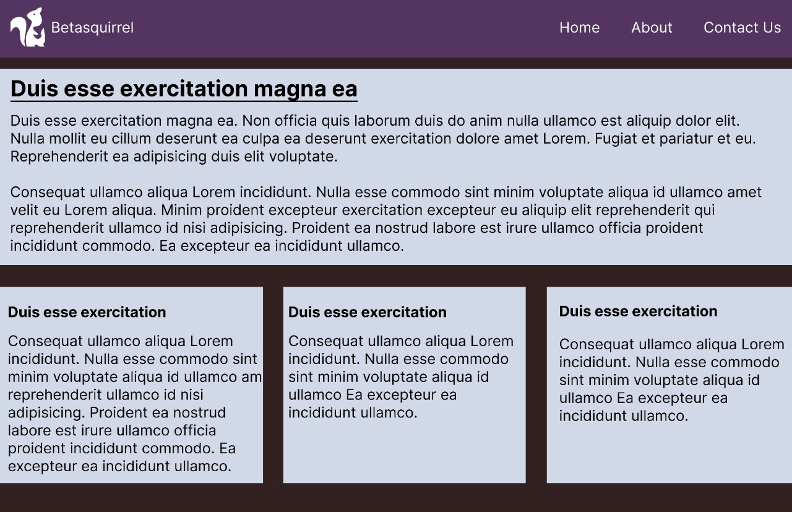

# betasquirrel-tasks

assignments from betasquirrel

## requirements

| requirements                  | output                           |
| ----------------------------- | -------------------------------- |
|  |  |
|  |  |
|   |  |

## linux Commands

- `cd` - change current directory. Ex: `cd Desktop`, `cd ..`
- `ls` -list content of a directory, Ex: `ls -a` lists hidden files as well.
- `pwd` -display current working directory path
- `cat` -display content of a file. Ex: `cat README.md`

## Git Commands

1. `git config` configure git user. Ex: `git config --global user.name "abdulgafoor", `git config user.email "gafoorziya0@gmail.com"`
2. `git clone` clone a remote git repo to your local. Ex: `git clone https://github.com/abdulgafoor/betasquirrel-tasks.git`, `git clone https://github.com/abdulgafoor/betasquirrel-tasks.git new-folder`
3. `git add` add your file changes to git. Ex: `git add .`, `git add README.md`
4. `git commit` commit changes to git. Ex: `git commit -m "Initial commit"`
5. `git push` push your local commits to remote repo. Ex: `git push origin main`

- [html](https://www.w3schools.com/html/default.asp)

- [introduction](https://www.w3schools.com/html/html_intro.asp)

- [editors](https://www.w3schools.com/html/html_editors.asp)

- [basic](https://www.w3schools.com/html/html_basic.asp)

- [elements](https://www.w3schools.com/html/html_elements.asp)

- [attributes](https://www.w3schools.com/html/html_attributes.asp)

- [headings](https://www.w3schools.com/html/html_headings.asp)

- [paragraphs](https://www.w3schools.com/html/html_paragraphs.asp)

- [styles](https://www.w3schools.com/html/html_styles.asp)

- [formatting](https://www.w3schools.com/html/html_formatting.asp)

- [quotations](https://www.w3schools.com/html/html_quotation_elements.asp)

- [comments](https://www.w3schools.com/html/html_comments.asp)

- [colors](https://www.w3schools.com/html/html_colors.asp)

- [css](https://www.w3schools.com/html/html_css.asp)

- [links](https://www.w3schools.com/html/html_links.asp)

- [images](https://www.w3schools.com/html/html_images.asp)

- [favicon](https://www.w3schools.com/html/html_favicon.asp)

- [tables](https://www.w3schools.com/html/html_tables.asp)

- [list](https://www.w3schools.com/html/html_lists.asp)

- [block&inline](https://www.w3schools.com/html/html_blocks.asp)

- [classes](https://www.w3schools.com/html/html_classes.asp)

- [id](https://www.w3schools.com/html/html_id.asp)

## Demo

- [Stack-overflow](https://stackoverflow.com/users/21198561/gafoor-tharuvanna)

- [Linkedin](https://www.linkedin.com/in/gafoor-tharuvanna-7526b825b/)
